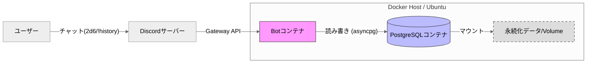
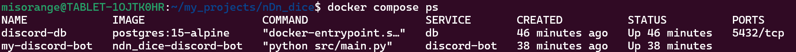
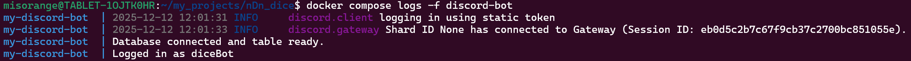

# サーバ構築手順書：Docker ComposeによるDiscord Botとデータベースの連携システム

## 1. 概要
本手順書は、Python製のDiscord Bot（ダイスBot）とPostgreSQLデータベースをDocker Composeを用いて構築し、サービスの永続化およびデータ連携を実現する手順をまとめたものである。
構築手順全体をコード化（Infrastructure as Code）し、GitHubリポジトリを経由することで、コマンド一つで誰でも同一の環境を再現可能にすることを目標とする。

* **目的:**
    1.  Botサービスとデータベースを連携させ、実行ログ（ダイス結果）を永続的に保存・参照可能にする。
    2.  サーバ再起動時やプロセスダウン時に自動復旧する、可用性の高いBot環境を構築する。
* **完成条件:**
    1.  `git clone` と `docker compose up` の実行のみで環境構築が完了すること。
    2.  Discord上で `2d6` コマンドに応答し、`!history` コマンドで過去のログを表示できること。

## 2. 前提条件
* **対象OS:** Ubuntu 24.04 LTS (WSL2 または ローカルVM)
* **実行環境:** ローカル開発環境、または学内クラウド等のLinuxサーバ
* **利用ツール:**
    * Docker Engine (v24.0以上推奨)
    * Docker Compose (v2.0以上推奨)
    * Git
* **ネットワーク条件:**
    * アウトバウンド通信（HTTPS/WebSocket）が可能であること。
    * ※BotはGateway接続を行うため、インバウンドのポート開放（固定IP）は不要。

## 3. 追加する発展要素
**選択要素：例B（Docker Compose による Web＋DB の 2 コンテナ構成）**

授業で扱った既存イメージ（WordPress等）の利用から発展させ、以下の要素を独自に設計・実装した。

1.  **マイクロサービス構成の設計:**
    アプリ（Bot）とデータ（DB）を別コンテナに分離し、Dockerネットワーク内でのみ通信させるセキュアな構成とした。
2.  **独自ビルド環境の構築:**
    既存イメージを使うのではなく、`Dockerfile` を自作してPython環境を定義し、依存ライブラリ（`discord.py`, `asyncpg`）やログ設定（`PYTHONUNBUFFERED`）を組み込んだカスタムイメージを作成した。
3.  **機密情報の分離管理:**
    授業のサンプルでは設定ファイルに直書きされていたパスワード類を廃止し、`.env` ファイルと環境変数を用いたセキュリティ強度の高い管理手法を採用した。

## 4. 全体構成図
Botコンテナは外部(Discord)とGateway通信を行い、内部ネットワークを通じてDBコンテナへデータを永続化する。



## 5. 事前準備
本環境構築にはDockerおよびDiscord Botアカウントが必要となる。以下の手順で準備を行った。

1.  **Discord Botの登録と設定**
    * [Discord Developer Portal](https://discord.com/developers/applications) にアクセスし、「New Application」からアプリを作成する。
    * **Bot** メニューから「Reset Token」を実行し、Tokenを取得して控えておく（後述の `.env` 設定で使用）。
    * 同画面の **Privileged Gateway Intents** にある **"Message Content Intent"** をONにして保存する（※重要：これがないとメッセージ内容を読み取れない）。
    * **OAuth2 > URL Generator** から `bot` スコープを選択し、権限（Send Messages, Read Message History等）を付与して招待URLを発行し、使用するサーバに追加しておく。

2.  **システム更新とGitのインストール**
    ```bash
    sudo apt update && sudo apt install -y git ca-certificates curl
    ```

3.  **Dockerエンジンのインストール（公式リポジトリ経由）**
    古いパッケージを削除し、Docker公式のGPGキーとリポジトリを設定してインストールを行った。
    
    ```bash
    # 1. 競合パッケージの削除
    for pkg in docker.io docker-doc docker-compose docker-compose-v2 podman-docker containerd runc; do sudo apt-get remove $pkg; done

    # 2. 必要なディレクトリ作成とGPGキーのダウンロード
    sudo install -m 0755 -d /etc/apt/keyrings
    sudo curl -fsSL [https://download.docker.com/linux/ubuntu/gpg](https://download.docker.com/linux/ubuntu/gpg) -o /etc/apt/keyrings/docker.asc
    sudo chmod a+r /etc/apt/keyrings/docker.asc

    # 3. リポジトリの追加
    echo \
      "deb [arch=$(dpkg --print-architecture) signed-by=/etc/apt/keyrings/docker.asc] [https://download.docker.com/linux/ubuntu](https://download.docker.com/linux/ubuntu) \
      $(. /etc/os-release && echo "$VERSION_CODENAME") stable" | \
      sudo tee /etc/apt/sources.list.d/docker.list > /dev/null
    
    # 4. パッケージリスト更新とインストール実行
    sudo apt update
    sudo apt install -y docker-ce docker-ce-cli containerd.io docker-buildx-plugin docker-compose-plugin
    ```

4.  **実行権限の設定**
    一般ユーザーでDockerコマンドを実行可能にするため、グループ設定を行った。
    ```bash
    sudo usermod -aG docker $USER
    newgrp docker
    ```

## 6. 構築手順
再現性を高めるため、GitHubリポジトリを利用したデプロイ手順を採用する。

### 6-1. ソースコードの取得
以下のコマンドを実行し、環境構築に必要なファイル一式を取得する。

```bash
cd ~
git clone https://github.com/misorange/nDn_dice_bot.git
cd nDn_dice_bot
```
**【リポジトリURL】** https://github.com/misorange/nDn_dice_bot

### 6-2. 設定ファイルの作成（秘密情報の注入）
セキュリティ保護のため、リポジトリには秘密情報が含まれていない。サンプルを複製し、自身の環境情報を設定する。

```bash
cp .env.sample .env
nano .env
```
**設定ファイル (.env) の内容:**
```text
DISCORD_TOKEN=OTM... (自身のBot Tokenを記述)
DB_USER=bot_user
DB_PASSWORD=bot_password
DB_NAME=dice_logs
DB_HOST=db
```

### 6-3. 構成ファイルの確認（完全版）
本環境を構成する主要ファイルの定義は以下の通りである。

**1. サービス定義 (compose.yaml)**
BotとDBの連携、および `restart: always` による永続化を定義している。
```yaml
services:
  discord-bot:
    build: .
    container_name: my-discord-bot
    restart: always
    env_file:
      - .env
    depends_on:
      - db

  db:
    image: postgres:15-alpine
    container_name: discord-db
    restart: always
    environment:
      POSTGRES_USER: bot_user
      POSTGRES_PASSWORD: bot_password
      POSTGRES_DB: dice_logs
    volumes:
      - db_data:/var/lib/postgresql/data

volumes:
  db_data:
```

**2. ビルド定義 (Dockerfile)**
セキュリティ（非root実行）と運用性（ログ即時出力）を考慮した定義となっている。
```dockerfile
FROM python:3.11-slim

# Pythonのログ・バッファリングを無効化（ログを即時出力）
ENV PYTHONUNBUFFERED=1

WORKDIR /app

# 依存ライブラリのインストール
COPY requirements.txt .
RUN pip install --no-cache-dir -r requirements.txt

# ソースコードの配置
COPY src/ ./src/

# セキュリティ対策：専用ユーザーでの実行
RUN useradd -m botuser
USER botuser

CMD ["python", "src/main.py"]
```

## 7. サービスの起動と永続化
Docker Composeを使用し、バックグラウンドモードでの起動とビルドを行う。
このコマンドにより、OS再起動時も自動的にサービスが立ち上がる設定（永続化）が適用される。

```bash
docker compose up -d --build
```

## 8. 動作確認と検証

### 8-1. コンテナ稼働状況の確認
`docker compose ps` を実行し、BotとDBのStatusが共に `Up` であることを確認した。

*図1: BotサービスとDBサービスが正常に稼働している様子*

### 8-2. ログおよび接続確認
`docker compose logs -f discord-bot` を実行し、以下の点を確認した。
* `connected to Gateway`: Discordサーバとの通信確立
* `Database connected`: DBコンテナへの接続成功

*図2: ログにてDB接続とDiscordログインの成功を確認*

### 8-3. 実際の機能検証
Discord上で以下の操作を行い、正常動作を確認した。
1.  `2d6` と入力 → 結果が返信される（DBへの書き込み成功）
2.  `!history` と入力 → 過去のログが表示される（DBからの読み出し成功）

    

    *図3: 実機でのダイス動作と履歴表示機能の確認*

## 9. トラブルシューティング

### 代表的な失敗例と対処

1.  **履歴機能が反応しない**
    * **原因:** 初回起動時、PostgreSQLの初期化完了前にBotが接続を試みてタイムアウトした場合、DB接続なしモードで起動してしまうことがある。
    * **対処:** `docker compose restart discord-bot` を実行し、Botのみ再起動して再接続させる。

2.  **認証エラー (Password authentication failed)**
    * **原因:** `.env` のパスワードを変更したが、古いDBボリュームが残っているため反映されていない。
    * **対処:** `docker compose down -v` でボリュームを削除し、完全初期化を行う。

## 10. セキュリティ配慮
本構築では、以下のセキュリティ対策を実施した。

* **機密情報の分離:** Discord TokenおよびDBパスワードをリポジトリ（コード）に含めず、`.gitignore` された `.env` ファイルのみで管理した。
* **権限の最小化 (Least Privilege):** Dockerfile内で `botuser` を作成・指定し、コンテナ内での root 実行を回避することで、万が一の侵害時の被害を抑制した。
* **イメージの最小化:** ベースイメージに `slim` 版および `alpine` 版を採用し、脆弱性が含まれるリスクと攻撃対象領域（Attack Surface）を最小化した。

## 11. 参考資料
* Docker Documentation: https://docs.docker.com/
* discord.py Documentation: https://discordpy.readthedocs.io/
* asyncpg Documentation: https://magicstack.github.io/asyncpg/